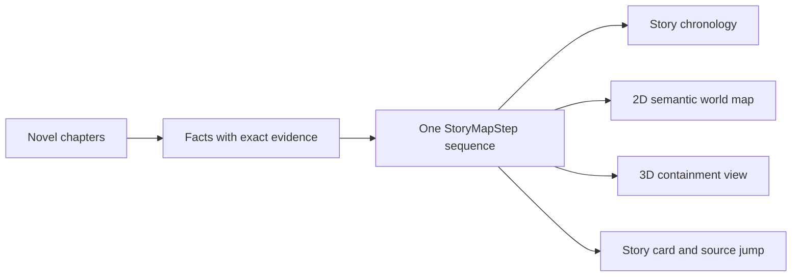

# Novel Atlas

[中文](README.md)

Novel Atlas turns long-form fiction into a character graph, story chronology, 2D/3D semantic world map, and searchable knowledge base, while keeping an exact source passage for every accepted fact

The current version is `2.7.0`. It is a runnable personal project, not a hosted multi-tenant service with a service-level commitment


> The screenshot uses the built-in synthetic 120-chapter stress demo and contains no user novel, account, real address, or model credential

## What it does

| Area | Current capability | Explicit boundary |
|---|---|---|
| Character graph | Shows all evidenced relationships with 2D/3D views, pan, zoom, drag, hover focus, and manual correction | Apparently isolated characters are reviewed again; relationships are never inferred silently from common sense |
| Story chronology | Separates narrative order from story order and records flashbacks, dreams, prophecies, and parallel events | Unsupported time claims stay unknown and temporal cycles enter conflict resolution |
| Semantic world map | 2D, 3D, playback, and story cards consume one `StoryMapStep` sequence | Colored regions organize story topology and are not claimed as explicit borders or terrain |
| Narrative memory | Tracks causes, actions, results, state changes, and open threads, then assembles coherent summaries locally | Motives, psychology, and causality without source evidence cannot be added |
| Three-layer knowledge base | Organizes characters, places, factions, items, skills, and rules as claims, concepts, and reader views | Automatic deduplication cannot merge incompatible namesakes |
| Library | Folders, import, rename, move, delete, backup, and incremental append | Earlier results are reused when compatible; conflicts enter automatic or manual resolution |
| Quality and collaboration | Evidence, cost, prompts, run manifests, conflicts, and regression cases | Conflicts never remain as generic dangling errors |

## One fact sequence, several views

The map is not a second plot model. The chronology, 2D map, 3D map, and story details all read one ordered sequence



2D coordinates prioritize explicit direction and containment evidence. Sparse evidence falls back to a deterministic seeded topology that is labeled as direction-unknown

The 3D view reuses the same X/Y coordinates. Z represents evidenced containment depth only, never altitude


## First local run

Python 3.11 or newer is required

```powershell
python -m venv .venv
.\.venv\Scripts\Activate.ps1
python -m pip install -e ".[test]"
python -m uvicorn app.main:app --host 127.0.0.1 --port 8765
```

Open `http://127.0.0.1:8765/`

The first start creates a local SQLite database and four synthetic demo books without calling a hosted model

Import supports TXT, Markdown, EPUB, HTML, DOCX, and text-layer PDF. Scanned-image PDFs, encrypted PDF/EPUB files, and suspicious archives are rejected

## Model channels and cost boundary

- DeepSeek Platform API
- Moonshot Platform API
- A user-initiated local Codex CLI channel authenticated through ChatGPT

Local rules perform splitting, evidence verification, cache decisions, and deterministic deduplication first. Models receive low-confidence cases, conflicts, and critical-subject reviews

Model credentials are excluded from browser responses, the database, the repository, and release packages. Public deployments do not receive paid model credentials by default

## Container run

```bash
docker compose -f deploy/compose.yaml up -d --build
curl http://127.0.0.1:18765/readyz
```

The container binds only to `127.0.0.1:18765` and should be exposed through a controlled reverse proxy and identity gateway

See [docs/DEPLOYMENT.md](docs/DEPLOYMENT.md) for deployment, backup, and rollback

## Current verification evidence

```powershell
python -m pytest -q
node --check static/app.js
npx playwright test tests/e2e_ui.spec.js --reporter=line
powershell -NoProfile -ExecutionPolicy Bypass -File scripts/check_current_state.ps1
```

The current 2.7.0 gate reports

- 104 passing Python tests and 1 environment-dependent skip
- 3 passing Chromium flows on synthetic data
- 1 local Journey to the West acceptance flow covering 1,049 chronology steps and 94 currently relevant places
- passing JavaScript syntax and current-state contract checks
- browser coverage for rapid navigation, 2D/3D parity, explicit final-step completion, long-form label collisions, narrow layouts, and knowledge search

The real-novel acceptance database and screenshots remain local and are excluded from the public repository

These numbers describe fixed samples only. They do not imply 95% accuracy for arbitrary novels. The formal target still requires at least five real works, 300 human-confirmed gold cases, 100% pass on critical cases, and at least 95% weighted accuracy on a holdout set

## Data and security

- Novel text, databases, uploads, run output, credentials, and build artifacts stay outside version control
- A formal fact without an exact source passage remains unknown or unresolved
- Public instances use a separate empty data volume and never copy the maintainer's local library
- Publication scans current files, history, visual metadata, secrets, and identity markers
- Importers must confirm that they have permission to process each work

See [docs/PRODUCT_CONTRACT.md](docs/PRODUCT_CONTRACT.md) for the product contract and [docs/CURRENT_STATE.md](docs/CURRENT_STATE.md) for the current implementation state

## Project status and license

Model extraction can still be wrong. Subtle foreshadowing, namesakes, unreliable narration, and implicit locations need human review

No open-source license is currently included. Do not copy, modify, or redistribute the code without permission
