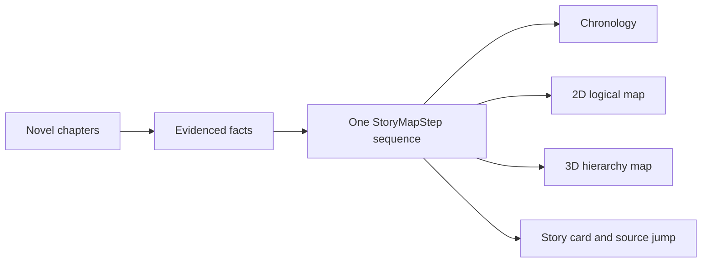

# Novel Atlas

[中文](README.md)

Novel Atlas turns long-form fiction into a character graph, story chronology, 2D/3D logical map, world notes, and searchable records. Every accepted fact keeps a link back to its source passage.

The current version is `2.6.0`. Its main change is structural: chronology and maps no longer maintain separate story sequences, and switching between 2D and 3D does not re-run analysis or lose the current step.


> The screenshot uses the built-in synthetic 120-chapter stress demo. It contains no user novel, account data, or model credential.

## What it does

| Area | Capability | Safety boundary |
|---|---|---|
| Character graph | Shows every evidenced relationship; includes 2D/3D views, pan, zoom, drag, hover focus, and manual correction | Apparently isolated characters are reviewed again; relationships are never invented silently |
| Story chronology | Separates narrative order from story order and handles flashbacks, dreams, prophecies, and parallel events | Cyclic time claims are isolated as conflicts |
| Logical map | 2D and 3D consume the same `StoryMapStep`; actor, event card, location, and source passage advance together | When direction evidence is missing, the map is labeled as a chronology schematic rather than geography |
| World notes | Search, categories, create, edit, archive, restore, and evidence-limited regeneration | External context is stored separately from facts stated in the novel |
| Record database | Items, skills, attributes, parameters, and terms | Supports manual edits, draft previews, and change history |
| Library | Folders, import, rename, move, delete, backup, and incremental append | Existing chapters are reused when new text does not conflict |
| Quality and collaboration | Evidence coverage, conflicts, cost, full prompts, rules, run manifests, and regression cases | Conflicts become auto-resolved, awaiting choice, resolved, or evidence-insufficient states—not dangling errors |

## How the two views stay aligned

The 2D map, 3D map, chronology list, and story details consume one ordered step sequence. A view switch changes only the projection; it does not change data or call a model.



Height in the 3D view represents containment only, never altitude. When reliable direction evidence is sparse, the 2D view uses a clearly labeled first-visit chronology schematic.


## Files and model providers

The importer accepts TXT, Markdown, EPUB, HTML, DOCX, and text-layer PDF. TXT supports UTF-8, UTF-8 BOM, and GB18030. Encrypted EPUB files, suspicious archives, scanned-image PDFs, and encrypted PDFs are rejected.

Analysis adapters include:

- DeepSeek Platform API
- Moonshot Platform API
- A user-initiated local Codex CLI channel authenticated through ChatGPT

Model credentials are excluded from browser responses, the database, the repository, and release packages. Public deployments do not receive paid model credentials by default.

## Run locally

Python 3.11 or newer is required.

```powershell
python -m venv .venv
.\.venv\Scripts\Activate.ps1
python -m pip install -e ".[test]"
python -m uvicorn app.main:app --host 127.0.0.1 --port 8765
```

Open `http://127.0.0.1:8765/`. The first start creates a local SQLite database and four synthetic demo books without calling a hosted model.

## Run in a container

```bash
docker compose -f deploy/compose.yaml up -d --build
curl http://127.0.0.1:18765/readyz
```

The container binds only to `127.0.0.1:18765`, so a controlled reverse proxy can provide external access. See [docs/DEPLOYMENT.md](docs/DEPLOYMENT.md) for deployment and rollback.

## Verification

```powershell
python -m pytest -q
node --check static/app.js
npx playwright test tests/e2e_ui.spec.js --reporter=line
powershell -NoProfile -ExecutionPolicy Bypass -File scripts/check_current_state.ps1
```

The 2.6.0 fixed gate currently contains 98 Python tests, two real Chromium flows, JavaScript syntax validation, and a current-state contract check. Browser coverage includes:

- step, title, and location parity after 2D/3D switches
- rapid navigation continuing from the current animation frame
- an explicit end state instead of an endless spinner
- no lost nodes in the 120-chapter, 24-location stress demo
- controls at least 40 pixels tall and visible keyboard focus on narrow screens

These counts demonstrate the fixed test set only. They do not imply 95% accuracy for arbitrary novels. The formal quality target still requires at least five real works, 300 human-confirmed gold cases, 100% pass on critical cases, and at least 95% weighted accuracy on the holdout set.

## Data and security boundaries

- Novel text, databases, uploads, run outputs, credentials, and build artifacts are excluded from version control.
- A claim without an exact source passage remains unknown or unresolved; the system does not guess.
- Public instances use a separate empty data volume and never copy the maintainer's local library.
- Before publication, current files, history, generated artifacts, image metadata, secrets, and identity markers are scanned.
- Users are responsible for confirming that they have permission to process imported works.

See [docs/PRODUCT_CONTRACT.md](docs/PRODUCT_CONTRACT.md) for the product contract and [docs/CURRENT_STATE.md](docs/CURRENT_STATE.md) for the current implementation contract.

## Project status

This is a working personal project, not a hosted multi-tenant service. Model extraction can still be wrong; subtle foreshadowing, namesakes, unreliable narration, and implicit locations require human review.

No open-source license is currently included. Do not copy, modify, or redistribute the code without permission.
