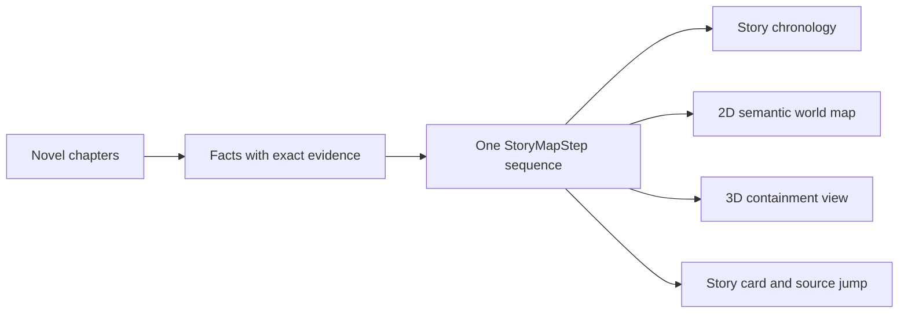

# Novel Atlas

[中文](README.md)

Novel Atlas turns long-form fiction into a character graph, story chronology, 2D/3D semantic world map, and searchable knowledge base, while keeping an exact source passage for every accepted fact

The current version is the `2.9.2-rc.1` release candidate. It is a runnable personal project, not a hosted multi-tenant service with a service-level commitment


> The screenshot uses the built-in synthetic 120-chapter stress demo and contains no user novel, account, real address, or model credential

## What it does

| Area | Current capability | Explicit boundary |
|---|---|---|
| Character graph | Shows all evidenced relationships with 2D/3D views, pan, zoom, drag, hover focus, and manual correction | Apparently isolated characters are reviewed again; relationships are never inferred silently from common sense |
| Story chronology | Separates narrative order from story order and records flashbacks, dreams, prophecies, and parallel events | Unsupported time claims stay unknown and temporal cycles enter conflict resolution |
| Semantic world map | 2D, 3D, playback, and story cards consume one `StoryMapStep` sequence, and movement highlights the active region | Colored regions organize evidenced containment or story links and are not claimed as explicit borders or terrain |
| System graphs | Keeps cultivation ranks, organization roles, social strata, item tiers, and classification networks separate | A system stays hidden without source evidence, and incomparable nodes remain side by side |
| Narrative memory | Tracks causes, actions, results, state changes, and open threads, then assembles coherent summaries locally | Motives, psychology, and causality without source evidence cannot be added |
| Three-layer knowledge base | Organizes characters, places, factions, items, skills, and rules as claims, concepts, and reader views | Automatic deduplication cannot merge incompatible namesakes |
| Library | Folders, import, rename, move, delete, backup, and incremental append | Earlier results are reused when compatible; conflicts enter automatic or manual resolution |
| Quality and collaboration | Evidence, cost, prompts, run manifests, conflicts, and regression cases | Conflicts never remain as generic dangling errors |

## One fact sequence, several views

The map is not a second plot model. The chronology, 2D map, 3D map, and story details all read one ordered sequence



2D coordinates prioritize explicit direction and containment evidence. Sparse evidence falls back to a deterministic seeded topology that is labeled as direction-unknown. Continuous zoom changes label and secondary-route density without deleting real nodes

Region names come from explicit containers or representative real places, and labels sit outside their boundaries with short connector lines instead of numbered placeholders

The guided 3D atlas reuses the same X/Y coordinates. Z represents evidenced containment depth only, never altitude. The active route, region, and chronology step remain synchronized. Playback supports `0.5×`, `1×`, `1.5×`, and `2×`


## First local run

Python 3.11 or newer is required

```powershell
python -m venv .venv # Create an isolated project environment
.\.venv\Scripts\Activate.ps1 # Activate this project environment
python -m pip install -e ".[test]" # Install the app and test dependencies
python -m uvicorn app.main:app --host 127.0.0.1 --port 8765 # Start a local-only server
```

Open `http://127.0.0.1:8765/`

The first start creates a local SQLite database and four synthetic demo books without calling a hosted model

Import supports TXT, Markdown, EPUB, HTML, DOCX, and text-layer PDF. Scanned-image PDFs, encrypted PDF/EPUB files, and suspicious archives are rejected

## Model channels and cost boundary

- DeepSeek Platform API
- Moonshot Platform API
- A user-initiated local Codex CLI channel authenticated through ChatGPT

Local rules perform splitting, evidence verification, cache decisions, and deterministic deduplication first. Models receive low-confidence cases, conflicts, and critical-subject reviews

Cost Forecast 2.0 separates the median forecast, conservative ceiling, actual spend, remaining forecast, cache state, sample count, and confidence. It reports low confidence instead of fake precision when evidence is sparse

Model credentials are excluded from browser responses, the database, the repository, and release packages. Public deployments do not receive paid model credentials by default

## Container run

```bash
docker compose -f deploy/compose.yaml up -d --build # Build and start the loopback-only container
curl http://127.0.0.1:18765/readyz # Verify that the app and database are ready
```

The container binds only to `127.0.0.1:18765` and should be exposed through a controlled reverse proxy and identity gateway

See [docs/DEPLOYMENT.md](docs/DEPLOYMENT.md) for deployment, backup, and rollback

## Current verification evidence

```powershell
python -m pytest -q # Run API, migration, and product-contract tests
node --check static/app.js # Check browser script syntax
npx playwright test tests/e2e_ui.spec.js --reporter=line # Run synthetic browser flows
powershell -NoProfile -ExecutionPolicy Bypass -File scripts/check_current_state.ps1 # Verify version and dual-view contracts
```

The current 2.9.2-rc.1 gate reports

- 134 passing Python tests and 1 environment-dependent skip
- deterministic import checks for 1,868 source segments and more than 6.19 million characters across 12 open works, covering Chinese, English, Japanese, TXT, HTML, and EPUB
- 7 passing Chromium flows, with 3 specialized long-form acceptance flows conditionally skipped in this run
- a separate browser acceptance flow that searches, opens, and verifies source, license, and analysis-scope details for all 12 open works
- 20 bounding-box checks across five viewport sizes and four effective zoom levels, with all four large-demo regions visible in both 2D and 3D
- the current chronology, place, people, and source button remain visible at 1366×768, while stale story-context requests cannot cross book switches
- passing JavaScript syntax and current-state contract checks
- browser coverage for rapid navigation, 2D/3D parity, complete region visibility, explicit final-step completion, narrow layouts, unified selectors, spoiler-progress input, and knowledge search

The real-novel acceptance database and screenshots remain local and are excluded from the public repository

These numbers describe fixed samples only and do not imply 95% accuracy for arbitrary novels. The database currently contains 28 machine-prepared candidates, 0 provably human-confirmed cases, and 0 valid sealed holdouts

The formal quality corpus contains 12 open works, each requiring 20 development cases and 5 sealed holdouts

Five Chinese classics are direct coverage; the other seven works provide cross-language and adjacent-genre proxies. They do not constitute direct validation for contemporary commercial web fiction, light novels, women's fiction, or urban fiction

## Data and security

- Novel text, databases, uploads, run output, credentials, and build artifacts stay outside version control
- A formal fact without an exact source passage remains unknown or unresolved
- The public repository and unauthenticated endpoints contain no novel full text; traceable open works are stored only in an Authentik-protected private library
- Publication scans current files, history, visual metadata, secrets, and identity markers
- Importers must confirm that they have permission to process each work

See [docs/PRODUCT_CONTRACT.md](docs/PRODUCT_CONTRACT.md) for the product contract and [docs/CURRENT_STATE.md](docs/CURRENT_STATE.md) for the current implementation state

## Project status and license

Model extraction can still be wrong. Subtle foreshadowing, namesakes, unreliable narration, and implicit locations need human review

No open-source license is currently included. Do not copy, modify, or redistribute the code without permission
