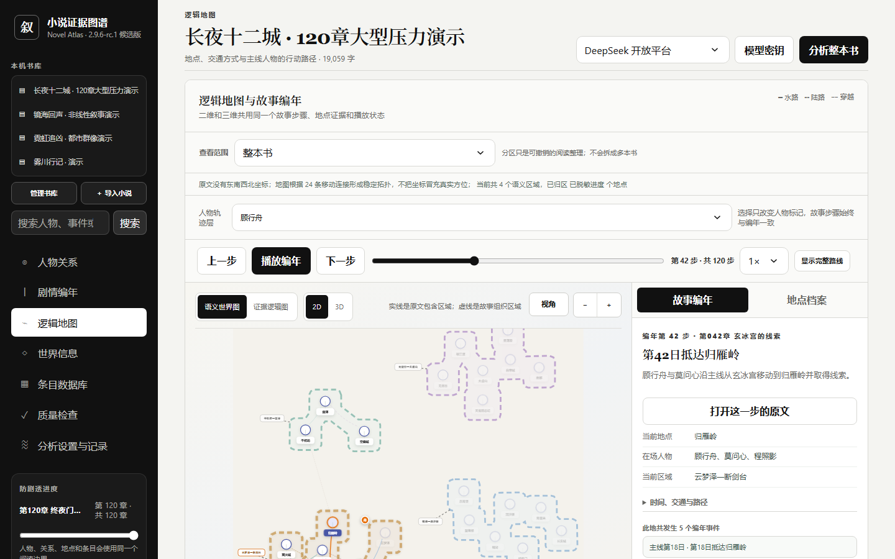
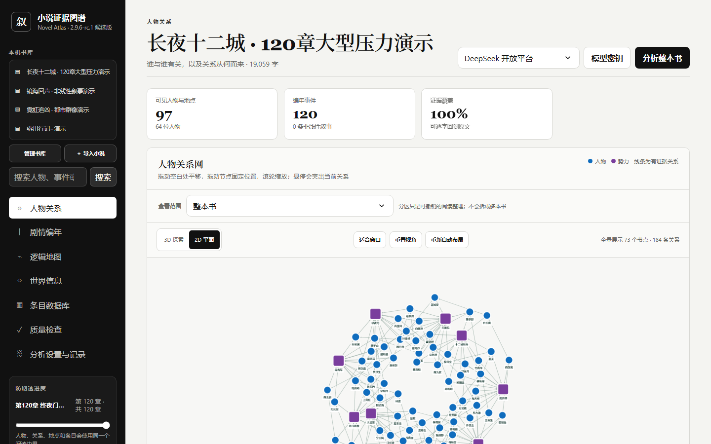
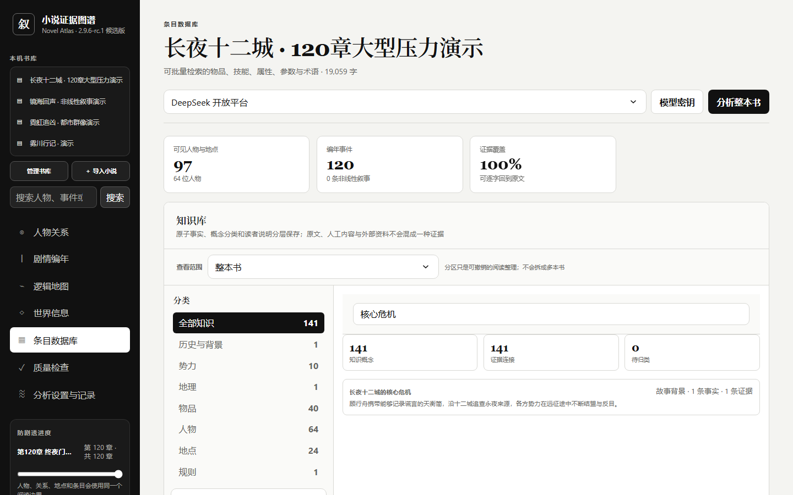
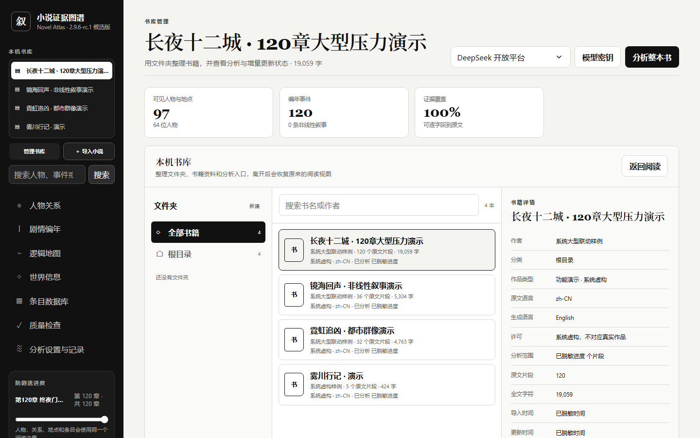
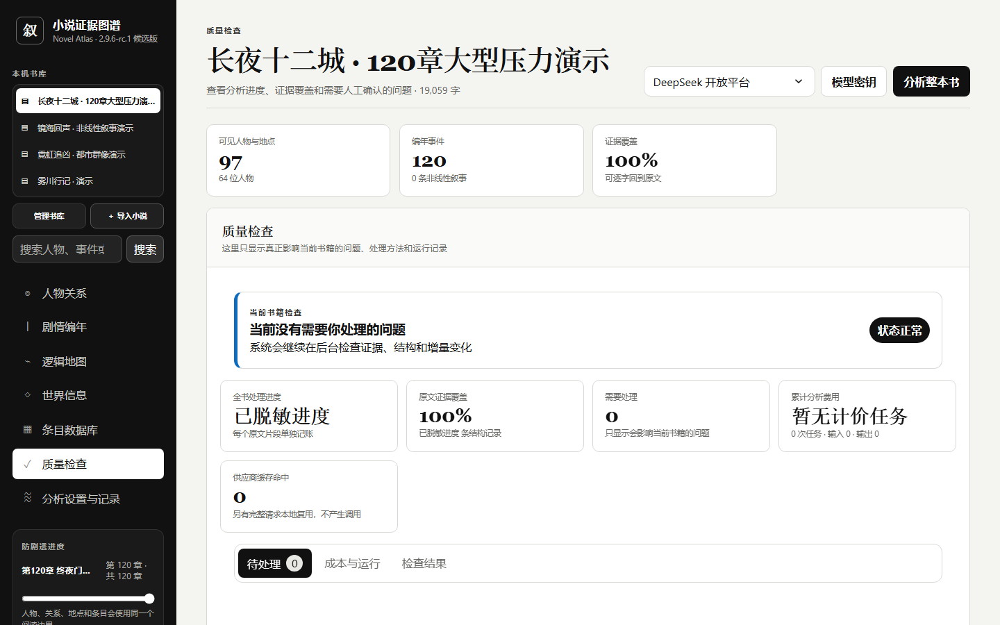
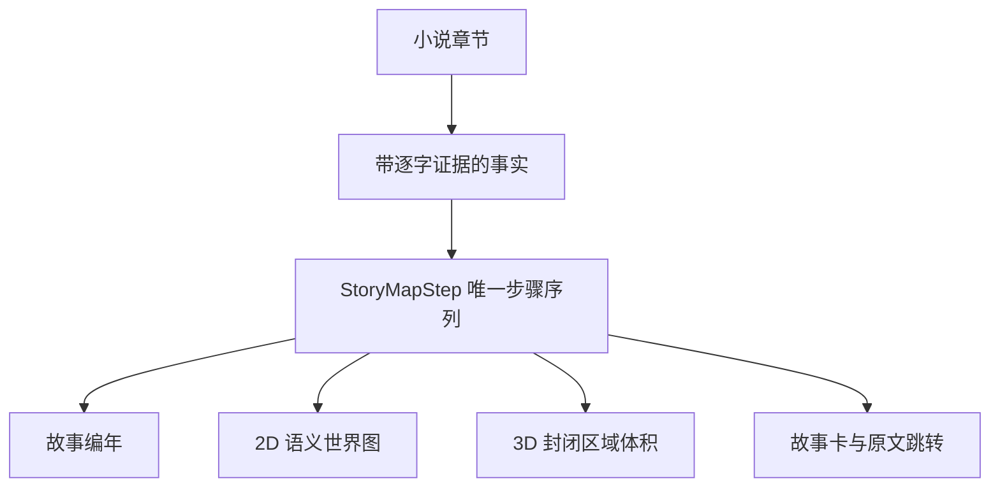
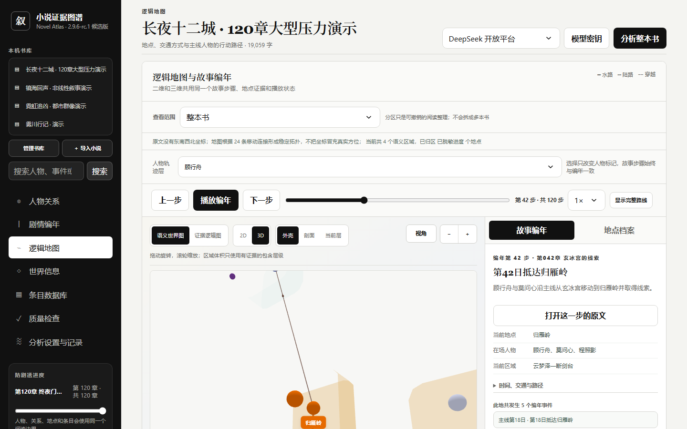

<div align="center">
  <h1>小说证据图谱</h1>
  <p>把长篇小说整理成人物关系、故事编年、2D/3D 语义世界图和可检索知识库，每条正式事实都保留原文出处</p>
  <p><strong>2.9.6-rc.1 候选版</strong> · <a href="README.en.md">English</a> · <a href="docs/CURRENT_STATE.md">当前验证状态</a> · <a href="docs/DEPLOYMENT.md">部署与回滚</a></p>
</div>

这是一个可本地运行的个人项目，不是已经承诺服务等级的多租户平台；项目不宣称任意小说都能达到固定准确率，普通用户只需要处理会真实影响当前书籍的问题



> 截图来自项目自带的 120 章合成压力演示，不含用户小说、账号、真实地址或模型密钥

## 实际运行界面

以下截图均由当前版本在本机浏览器中实际运行后生成；画面只使用内置合成演示，保留真实布局、交互控件和数据密度，同时移除用户内容与运行环境信息

| 人物关系与证据连线 | 世界知识与检索 |
|---|---|
|  |  |
| **三栏书库管理** | **零待处理时的质量页** |
|  |  |

地图、关系、知识、书库和质量页来自同一次可复现的浏览器截图流程；维护者可以指定隔离演示地址并设置 `CAPTURE_README_SCREENSHOTS=1`，再运行 `tests/capture_readme_screenshots.spec.js` 重新生成

## 能解决什么

| 模块 | 当前能力 | 明确边界 |
|---|---|---|
| 人物关系 | 展示全部有证据关系，支持 2D/3D、拖动、缩放、悬停聚焦和人工修正 | 疑似孤立人物会再次检查，不能凭常识静默补关系 |
| 故事编年 | 区分叙述顺序与故事顺序，记录回忆、倒叙、梦境、预言和并行事件 | 证据不足时保留未知，时间循环进入可解决冲突 |
| 语义世界图 | 2D、3D、播放条和故事卡共用唯一的 `StoryMapStep`，人物移动会同步突出当前区域；边界同时包住节点、标签和子区域 | 彩色区域只整理有证据的包含关系或故事联系，不代表原文明示国界或地貌 |
| 体系图谱 | 分别展示修炼等级、组织职位、社会阶层、物品品阶和分类网络 | 没有原文证据时不显示体系，无法比较时明确并列 |
| 叙事记忆 | 保存前因、行动、结果、状态变化和未闭合线索，本地组合连贯摘要 | 未被原文支持的动机、心理和因果不得补写 |
| 三层知识库 | 用原子事实、概念关系和读者视图管理人物、地点、势力、物品、技能与规则 | 自动去重不能合并证据不兼容的同名对象 |
| 书库 | 左侧文件夹与书籍树支持导入、改名、移动、删除、备份和增量更新 | 未变化章节不重复调用模型；冲突进入自动解决或人工处理 |
| 审核与设置 | 待处理事项说明问题、影响、建议、证据和操作；分析设置保留阅读规则、成本与运行记录 | 已自动解决的记录进入历史，冲突不会作为普通报错悬挂 |
| 报告语言 | 每本书可以选择跟随原文、中文或 English；未来生成的报告与说明使用所选语言 | 人名、书名、用户文字和逐字证据保持原样；已有结果不会被静默改写 |

## 一套事实，多个视图

地图不是另一套剧情，2D、3D、编年列表和故事详情只读取同一份有序步骤



二维坐标优先服从原文明示方位和包含关系，证据稀疏时使用带固定种子的拓扑布局，并明确标注方位未知；连续缩放会按视野密度收放标签和次要路线，不会删除真实节点

区域名称来自原文容器或区域内的代表地点；边界由节点圆形、节点文字和子区域的实际占用几何生成，并在失败时退回保证包含的边界；标签优先使用内部标题角，没有空间时进入两侧轨道

三维导览沿用相同的 X/Y，Z 只表示有证据的地域包含深度，不代表海拔；区域使用包含上下表面和侧壁的封闭体积，并提供外壳、剖面和当前层观察方式；当前路线、区域和编年步骤保持同步



## 本机首次运行

需要 Python 3.11 或更新版本

```powershell
python -m venv .venv # 创建项目隔离环境
.\.venv\Scripts\Activate.ps1 # 激活当前项目环境
python -m pip install -e ".[test]" # 安装应用和测试依赖
python -m uvicorn app.main:app --host 127.0.0.1 --port 8765 # 只在本机启动服务
```

打开 `http://127.0.0.1:8765/`

首次启动会创建本机 SQLite 数据库和四本合成演示书，不调用云端模型

支持 TXT、Markdown、EPUB、HTML、DOCX 和带文字层的 PDF，扫描图片 PDF、加密 PDF、加密 EPUB 和异常压缩包会被拒绝

上传、删除、增量更新和模型调用都会改变本机数据或产生费用；先使用合成演示验证流程，正式操作前备份数据库，并只处理自己有权使用的作品

## 模型通道与成本边界

- DeepSeek 开放平台 API
- Moonshot 开放平台 API
- 用户本人主动启动的 Codex CLI ChatGPT 登录通道

系统先用本地规则完成切分、证据核验、缓存和确定性去重，再把低置信度、冲突和关键主体交给模型

费用预测 2.0 分开展示中位预测、保守上限、实际消耗、剩余预测、缓存、样本量和置信度；样本不足时会标记低置信度，不输出伪精确结论

模型密钥不会进入网页响应、数据库、仓库或安装包，公开部署默认不配置任何付费模型密钥

## 容器运行

```bash
docker compose -f deploy/compose.yaml up -d --build # 构建并启动只绑定本机的容器
curl http://127.0.0.1:18765/readyz # 核对应用和数据库已经就绪
```

容器只绑定 `127.0.0.1:18765`，应由受控反向代理和身份网关提供外部访问

部署、备份和回滚说明见 [docs/DEPLOYMENT.md](docs/DEPLOYMENT.md)

## 当前验证证据

```powershell
python -m pytest -q # 运行接口、数据迁移和产品合同测试
node --check static/app.js # 检查浏览器脚本语法
npx playwright test tests/e2e_ui.spec.js --reporter=line # 运行合成环境浏览器流程
powershell -NoProfile -ExecutionPolicy Bypass -File scripts/check_current_state.ps1 # 核对版本与双视图合同
```

2.9.6-rc.1 当前固定门禁结果

- 149 项 Python 测试通过，1 项 Windows DPAPI 受保护路径测试按环境条件跳过
- 12 部本机开放作品完成 1,868 个原文片段和超过 619 万字符的确定性导入检查，覆盖中文、英文、日文与 TXT、HTML、EPUB
- 11 条 Chromium 浏览器流程通过，3 条依赖本机扩展夹具的条件流程未启用而跳过
- 12 部真实开放作品另行完成逐本搜索、打开、来源、许可和分析范围的浏览器验收
- 地图控制栏通过 5 种视口和 4 种有效缩放比例的 20 组包围框检查；区域几何逐项验证节点、标签、子区域和三维体积包含关系
- 1366×768 首屏可以直接看到当前编年、地点、人物和原文入口，切书时旧剧情知识请求不会再串到新书
- JavaScript 语法检查与当前状态合同检查通过
- 浏览器覆盖快速连续前进、2D/3D 同步、全部区域可见、末步结束、窄屏操作、三维关系悬停、故事范围切换、防剧透输入和知识库检索

真实长篇验收数据库和截图只留在本机，不进入公开仓库

这些数字只证明固定样本，不表示任意小说天然达到固定准确率；内部回归样本由维护流程自动管理，不再出现在普通界面，也不会要求读者完成题库或审核任务

普通质量页只显示证据缺失、身份冲突、关系缺口、时间矛盾、地点未确认和地图异常；系统能够安全判断的项目自动处理，无法确认的项目保留原文证据和明确操作

《西游记》《红楼梦》《水浒传》《三国演义》《聊斋志异》属于直接覆盖，其余 7 部属于跨语言和相近文体代理，不能冒充现代商业网文、商业轻小说、现代女频或现代都市小说的直接验证

## 数据与安全

- 小说正文、数据库、上传文件、运行输出、密钥和构建产物不进入版本控制
- 没有逐字证据的正式事实保持未知或待解决，不能猜测补全
- 公开仓库和未登录接口不含小说全文；来源与许可完整的开放作品只进入 Authentik 保护的私有书库
- 发布前扫描当前文件、版本历史、视觉元数据、秘密和身份信息
- 导入者需要确认自己拥有处理作品的合法权限

详细合同见 [docs/PRODUCT_CONTRACT.md](docs/PRODUCT_CONTRACT.md)，当前实现状态见 [docs/CURRENT_STATE.md](docs/CURRENT_STATE.md)

## 项目状态与许可

模型抽取仍可能出错，复杂伏笔、同名人物、不可靠叙述和隐含地点需要人工复核

仓库当前没有附带开源许可证，未获得许可前请不要复制、修改或再分发代码
