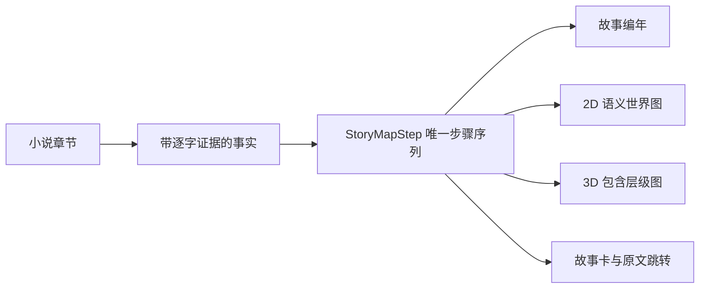

# 小说证据图谱

[English](README.en.md)

把长篇小说整理成人物关系、故事编年、2D/3D 语义世界图和可检索知识库，每条正式事实都保留原文出处

当前版本为 `2.9.1-rc.2` 候选版，这是一个可本地运行的个人项目，不是已经承诺服务等级的多租户平台


> 截图来自项目自带的 120 章合成压力演示，不含用户小说、账号、真实地址或模型密钥

## 能解决什么

| 模块 | 当前能力 | 明确边界 |
|---|---|---|
| 人物关系 | 展示全部有证据关系，支持 2D/3D、拖动、缩放、悬停聚焦和人工修正 | 疑似孤立人物会再次检查，不能凭常识静默补关系 |
| 故事编年 | 区分叙述顺序与故事顺序，记录回忆、倒叙、梦境、预言和并行事件 | 证据不足时保留未知，时间循环进入可解决冲突 |
| 语义世界图 | 2D、3D、播放条和故事卡共用唯一的 `StoryMapStep` | 彩色区域只整理故事拓扑，不代表原文明示国界或地貌 |
| 体系图谱 | 分别展示修炼等级、组织职位、社会阶层、物品品阶和分类网络 | 没有原文证据时不显示体系，无法比较时明确并列 |
| 叙事记忆 | 保存前因、行动、结果、状态变化和未闭合线索，本地组合连贯摘要 | 未被原文支持的动机、心理和因果不得补写 |
| 三层知识库 | 用原子事实、概念关系和读者视图管理人物、地点、势力、物品、技能与规则 | 自动去重不能合并证据不兼容的同名对象 |
| 书库 | 文件夹分类、导入、改名、移动、删除、备份和增量追加 | 旧内容无冲突时复用，冲突进入自动解决或人工处理 |
| 质量与协作 | 查看证据、成本、提示词、运行清单、冲突和回归案例 | 冲突不会作为普通报错悬挂 |

## 一套事实，多个视图

地图不是另一套剧情，2D、3D、编年列表和故事详情只读取同一份有序步骤



二维坐标优先服从原文明示方位和包含关系，证据稀疏时使用带固定种子的拓扑布局，并明确标注方位未知；连续缩放会按视野密度收放标签和次要路线，不会删除真实节点

三维导览沿用相同的 X/Y，Z 只表示有证据的地域包含深度，不代表海拔；当前路线、区域和编年步骤保持同步


## 本机首次运行

需要 Python 3.11 或更新版本

```powershell
python -m venv .venv # 创建项目隔离环境
.\.venv\Scripts\Activate.ps1 # 激活当前项目环境
python -m pip install -e ".[test]" # 安装应用和测试依赖
python -m uvicorn app.main:app --host 127.0.0.1 --port 8765 # 只在本机启动服务
```

打开 `http://127.0.0.1:8765/`

首次启动会创建本机 SQLite 数据库和四本合成演示书，不调用云端模型

支持 TXT、Markdown、EPUB、HTML、DOCX 和带文字层的 PDF，扫描图片 PDF、加密 PDF、加密 EPUB 和异常压缩包会被拒绝

## 模型通道与成本边界

- DeepSeek 开放平台 API
- Moonshot 开放平台 API
- 用户本人主动启动的 Codex CLI ChatGPT 登录通道

系统先用本地规则完成切分、证据核验、缓存和确定性去重，再把低置信度、冲突和关键主体交给模型

费用预测 2.0 分开展示中位预测、保守上限、实际消耗、剩余预测、缓存、样本量和置信度；样本不足时会标记低置信度，不输出伪精确结论

模型密钥不会进入网页响应、数据库、仓库或安装包，公开部署默认不配置任何付费模型密钥

## 容器运行

```bash
docker compose -f deploy/compose.yaml up -d --build # 构建并启动只绑定本机的容器
curl http://127.0.0.1:18765/readyz # 核对应用和数据库已经就绪
```

容器只绑定 `127.0.0.1:18765`，应由受控反向代理和身份网关提供外部访问

部署、备份和回滚说明见 [docs/DEPLOYMENT.md](docs/DEPLOYMENT.md)

## 当前验证证据

```powershell
python -m pytest -q # 运行接口、数据迁移和产品合同测试
node --check static/app.js # 检查浏览器脚本语法
npx playwright test tests/e2e_ui.spec.js --reporter=line # 运行合成环境浏览器流程
powershell -NoProfile -ExecutionPolicy Bypass -File scripts/check_current_state.ps1 # 核对版本与双视图合同
```

2.9.1-rc.2 当前固定门禁结果

- 125 项 Python 测试通过，1 项按环境条件跳过，其中5部本机公版全文完成1,011个原文片段和3,283,083个字符的确定性导入检查
- 7 条 Chromium 浏览器流程通过，3 条需要专用长篇验收库的流程按条件跳过
- 地图控制栏通过5种视口和4种有效缩放比例的20组包围框检查，大型演示的4个区域在2D和3D中全部可见
- 1366×768 首屏可以直接看到当前编年、地点、人物和原文入口，切书时旧剧情知识请求不会再串到新书
- JavaScript 语法检查与当前状态合同检查通过
- 浏览器覆盖快速连续前进、2D/3D 同步、全部区域可见、末步结束、窄屏操作、统一选择器、防剧透输入和知识库检索

真实长篇验收数据库和截图只留在本机，不进入公开仓库

这些数字只证明固定样本，不表示任意小说天然达到95%准确率；当前有28条机器准备的候选案例，可证明的人工确认案例为0，有效密封保留案例为0

正式质量集采用《西游记》《红楼梦》《三国演义》加1部用户授权的现代玄幻长篇和1部用户授权的现代都市或翻译长篇；每部60条，其中48条开发案例、12条密封保留案例，两部现代作品就位并完成人工核对前只能报告古典小说覆盖率

## 数据与安全

- 小说正文、数据库、上传文件、运行输出、密钥和构建产物不进入版本控制
- 没有逐字证据的正式事实保持未知或待解决，不能猜测补全
- 公开实例使用独立空数据卷，不复制维护者的本机书库
- 发布前扫描当前文件、版本历史、视觉元数据、秘密和身份信息
- 导入者需要确认自己拥有处理作品的合法权限

详细合同见 [docs/PRODUCT_CONTRACT.md](docs/PRODUCT_CONTRACT.md)，当前实现状态见 [docs/CURRENT_STATE.md](docs/CURRENT_STATE.md)

## 项目状态与许可

模型抽取仍可能出错，复杂伏笔、同名人物、不可靠叙述和隐含地点需要人工复核

仓库当前没有附带开源许可证，未获得许可前请不要复制、修改或再分发代码
