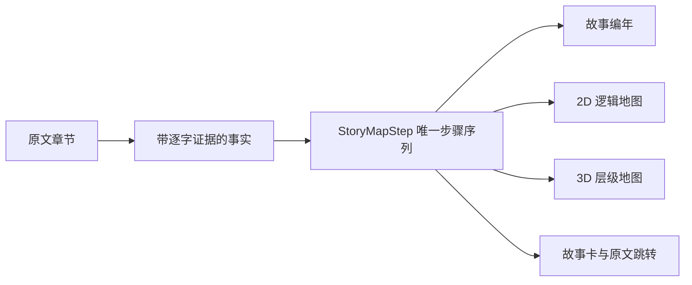

# 小说证据图谱

[English](README.en.md)

把长篇小说整理成人物关系、故事编年、2D/3D 逻辑地图、世界信息和可检索条目；每条正式事实都保留原文出处。

当前版本是 `2.6.0`。它重点解决两个问题：地图和编年不再各走一套剧情；二维与三维视图切换时不再重新分析或丢失当前步骤。


> 截图来自项目自带的 120 章合成压力演示，不含用户小说、账户或模型密钥。

## 现在能做什么

| 模块 | 能力 | 关键边界 |
|---|---|---|
| 人物关系 | 展示全部有证据关系；支持 2D/3D、拖动、缩放、悬停聚焦和人工修正 | 疑似孤立人物会二次复核，不静默补关系 |
| 故事编年 | 区分叙述顺序与故事顺序，处理回忆、倒叙、梦境、预言和并行事件 | 形成循环的时间判断会进入冲突处理 |
| 逻辑地图 | 2D 和 3D 共用同一 `StoryMapStep`；人物、事件卡、地点和原文同步前进 | 无方位证据时显示编年示意，不冒充真实地理 |
| 世界信息 | 按类别搜索、创建、编辑、归档、恢复和证据受限二次生成 | 外部资料和原文事实分开保存 |
| 条目数据库 | 管理物品、技能、属性、参数和术语 | 支持人工编辑、草稿预览与修改记录 |
| 书库 | 文件夹分类、导入、改名、移动、删除、备份和增量追加 | 旧剧情无冲突时只分析新增内容 |
| 质量与协作 | 查看证据覆盖、冲突、成本、完整提示词、规则、运行清单和回归案例 | 冲突进入自动解决、人工选择、已解决或证据不足，不作为普通报错悬挂 |

## 双视图如何保持一致

2D、3D、编年列表和故事详情只读取一份有序步骤。切换视图只改变画法，不改变数据，也不会调用模型。



三维视图的高度只表达“内部／包含”层级，不代表海拔。缺少可靠方位时，二维视图按首次到达顺序排成明确标注的编年示意图。


## 支持的文件和模型

导入器支持 TXT、Markdown、EPUB、HTML、DOCX 和带文字层的 PDF。TXT 支持 UTF-8、UTF-8 BOM 和 GB18030。加密 EPUB、异常压缩包、扫描图片 PDF 和加密 PDF 会被拒绝。

分析通道包括：

- DeepSeek 开放平台 API
- Moonshot 开放平台 API
- 本机用户主动启动的 Codex CLI ChatGPT 登录通道

模型密钥不会进入网页响应、数据库、仓库或安装包。公开部署默认不配置任何付费模型密钥。

## 本机运行

需要 Python 3.11 或更新版本。

```powershell
python -m venv .venv
.\.venv\Scripts\Activate.ps1
python -m pip install -e ".[test]"
python -m uvicorn app.main:app --host 127.0.0.1 --port 8765
```

打开 `http://127.0.0.1:8765/`。首次启动会创建本机 SQLite 数据库和四本合成演示书，不调用云端模型。

## 容器运行

```bash
docker compose -f deploy/compose.yaml up -d --build
curl http://127.0.0.1:18765/readyz
```

容器只把服务绑定到 `127.0.0.1:18765`，适合由 Nginx 或其他受控反向代理对外提供。部署和回滚说明见 [docs/DEPLOYMENT.md](docs/DEPLOYMENT.md)。

## 验证

```powershell
python -m pytest -q
node --check static/app.js
npx playwright test tests/e2e_ui.spec.js --reporter=line
powershell -NoProfile -ExecutionPolicy Bypass -File scripts/check_current_state.ps1
```

2.6.0 当前固定门禁为 98 项 Python 测试、2 条真实 Chromium 主流程、JavaScript 语法检查和当前状态合同检查。浏览器用例覆盖：

- 2D/3D 切换后步骤、标题和地点不漂移
- 快速连续点击后从当前动画帧继续
- 到达末步后按钮明确显示“已到末步”，不永久转圈
- 120 章、24 个地点的长篇演示不丢节点
- 窄屏主要按钮不小于 40 像素，键盘焦点可见

这些数字证明当前固定样本通过，不等于任意小说天然达到 95% 准确率。正式质量口径仍要求至少五部真实作品、300 条人工金标准、关键案例 100% 通过、保留集加权准确率不低于 95%。

## 数据与安全边界

- 小说正文、数据库、上传文件、运行输出、密钥和构建产物被版本规则排除。
- 正式事实没有逐字原文证据时显示未知或待解决，不猜测补全。
- 公开实例使用独立空数据卷，不复制维护者的本机书库。
- 公开发布前扫描当前内容、版本历史、生成物、图片元数据、密钥和身份信息。
- 用户需要确认自己对导入作品拥有合法使用权限。

详细产品合同见 [docs/PRODUCT_CONTRACT.md](docs/PRODUCT_CONTRACT.md)，当前实现合同见 [docs/CURRENT_STATE.md](docs/CURRENT_STATE.md)。

## 项目状态

这是可运行的个人项目，不是托管多租户服务。模型抽取仍会出错；复杂伏笔、同名人物、不可靠叙述和隐含地点需要人工复核。

当前仓库未附开源许可证。未获得许可前，请不要复制、修改或再分发代码。
