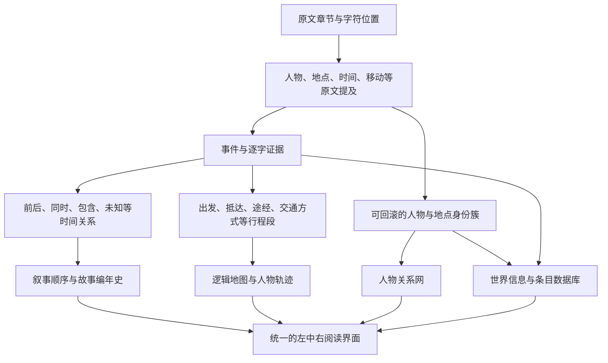

# 超长小说事实图谱重构确认稿

版本：确认前计划稿

当前状态：等待用户确认，运行中的应用保持不变

## 1 审计结论

本轮结论是转向底层语义数据重构，停止继续修补人物图、时间线和地图的表面表现

现有原文分段、逐字引文、成本记录和基础页面仍有价值，可以保留；人物归一、故事时间、人物行程三层需要重建

当前《西游记》数据中有 1049 个事件，其中 792 个事件的时间类型是“未知”；“石猴出世”的原文顺序是第一项，故事顺序却排到第 26 项[1]

模型返回的数值名次被直接写入故事顺序[2]

后续算法再用局部规则反复降低名次，并把结果压成连续序号[3]

两步组合后无法可靠解决跨章节偏序和冲突环[1][2][3]

地图从第四十七回附近开始也有明确原因

系统自动选择了“陈玄奘”，再按这个单一实体编号筛选行程；数据库里的“玄奘”“陈玄奘”“唐僧”仍是三个实体

即使先合并这三个别名，带地点的主线事件也只在 21 个原文片段中出现[1]

全书 1049 个事件中只有 90 个带地点，说明当前一般事件抽取没有覆盖大量出发、抵达、途经和转场[1][4]

统计口径为当前书目下的事件总数，以及地点编号非空的事件数；带地点事件占比为 90 ÷ 1049，约 8.6%[1]

节点消失来自现有显示规则

播放行程时，焦点窗口外的节点和路线被设为完全透明，并且无法点击[5]

关系图拖动结束后又会解除节点固定并重新加热整张图，用户刚摆好的位置会回弹或引发全局重排[5]

“74 组可能重复”不能原样交给用户判断[1]

现有候选只有名称、分数和简短理由，缺少支持证据、反证、同场人物、活动时间和身份冲突

系统可以自动处理大部分候选，但要用可追溯的证据裁决，不能只让同一个模型无依据地“自己问自己”

长篇人物共指本身仍是开放问题

成熟工具也会采用保守名字聚类，避免完整共指导致过度合并[6]

公开研究还表明，没有外部反馈时，模型自我纠错可能让结果变差[7]

## 2 可验收质量合同

任意超长小说的全部语义事实都达到 100% 无遗漏、100% 正确，目前没有诚实可行的技术保证[1][8]

长上下文研究已经证明，相关信息位于上下文中部时，模型表现经常下降[8]

如果产品继续展示笼统的“质量 100%”，用户会把它理解为内容完整且正确，这与当前事实不符

重构后把 100% 用在可以逐条验收的项目上

表 2.1 可保证项目与语义评测项目

| 项目 | 发布门槛 | 用户看到的结果 |
|---|---:|---|
| 原文片段登记 | 100%[1][8] | 每个章节和片段都有已处理、无可抽取项、失败或待处理状态 |
| 入库事实证据 | 100%[1][8] | 每个人物、关系、事件、地点、设定和条目都能跳到原文位置 |
| 叙事位置 | 100%[1][8] | 每个事件都有章节、段落和字符位置，绝不再显示“片段 1” |
| 不确定项登记 | 100%[1][8] | 无法确认的别名、时间和路线明确显示“待定”，不会静默猜测 |
| 行程缺口显示 | 100%[1][8] | 缺少出发地、目的地或交通方式时，用虚线路段和缺口说明展示 |
| 变更可回滚 | 100%[1][8] | 自动合并、二次生成和人工编辑都有版本历史与撤销 |
| 自动人物合并精确率 | 金标准中必须达到 100%[1][6] | 达不到门槛时降低自动处理范围，其余保留为待定 |
| 关键主线事件召回率 | 金标准中必须达到 100%[1][8] | 只统计人工预先标注的关键主线事件 |
| 全部细节事件召回率 | 试运行后给出实测值 | 页面展示样本、模型、提示词版本和置信区间，不写虚假满分 |
| 时间关系正确率 | 金标准目标不低于 99%，关系环为 0[1][9] | 无法稳定排序的事件进入并列或未知时间带 |
| 主线行程召回率 | 金标准中必须达到 100%[1][10] | 只统计人工预先标注的主线移动段 |

注：金标准是从真实小说中人工标注的一组标准答案

它用于测量系统能力，不能外推成所有小说永远零漏错

## 3 重构后的数据链路

图 3.1 重构后的证据驱动数据链路

第一层保存原文，任何模型结果都不能覆盖它

第二层记录原文中每一次人物、地点、时间和移动的出现

别名尚未归一也不会丢失原始提及

第三层才形成统一人物、统一地点、事件关系和行程

所有合并都有版本，拆错后可以恢复

人物图、时间线、地图、世界信息和数据库都从同一套规范数据生成，避免五个页面各自猜一遍

## 4 六项具体改造

### 4.1 人物重复候选自动裁决

默认流程改成系统自动处理，用户无需理解 74 组候选[1]

每组候选依次经过名称与称谓匹配、原文同一性证据、同场冲突、时间地点冲突、人物属性冲突和第二次独立复核

系统输出“自动合并”“确认分开”“证据不足”三种结果

前两种直接执行并保留撤销记录；证据不足不会阻塞全书分析，也不会强行合并，用户可以完全忽略，或在愿意时打开查看

同一模型可以承担初判和复核两个角色，但复核时必须看到原文证据、候选反证和固定裁决表

高风险候选优先由另一家模型复核

确定性规则拥有最终否决权，例如两个人在同一场景同时出现、性别或身份明确冲突时，禁止自动合并

现有删除旧实体的合并方式将被替换为身份簇

原始人物提及永久保留，统一名字只是一个可撤销视图

### 4.2 故事时间重建

模型不再返回“第几名”这种全局数字

它只判断可由原文支持的关系，例如 A 发生在 B 之前、A 是回忆内容、A 与 B 同时、关系不明

系统先用章节和字符位置建立绝对可靠的叙事顺序，再用时间关系建立故事顺序

关系图出现环时，本次判断不能进入正式编年史，相关事件进入冲突区等待下一轮证据复核

最终排序使用无环关系图，叙事顺序只在没有其他约束时负责稳定排序

时间标记语言（TimeML）也采用事件、时间表达和时间关系分开建模的思路[9]

界面保留“作者讲述顺序”和“故事发生顺序”两个视图

插叙、回忆、梦境、预言和倒叙显示明确标签

原文没有日期时，系统使用“第 1 回内”“拜师之前”“取经途中”这类相对时间，不虚构年月日

《西游记》的首批硬回归分为三项

- 石猴出世必须早于称王、拜师和大闹天宫

- 取经受命必须早于沿途诸难

- 任何时间关系环都阻止发布

### 4.3 逻辑地图主线行程

地图不再从一般事件里顺便捞地点，而是新增专用行程抽取

每一段行程记录出发地、目的地、途经地、出发事件、抵达事件、交通方式、同行者、原文证据和缺失字段

默认路线改为“故事主线”，按故事阶段切换主线人物或队伍

《西游记》开篇先展示孙悟空路线，取经开始后展示取经队伍

用户仍可切换孙悟空、唐僧等个人路线，避免单一人物编号截断整本书

地图保持全部已知地点和路线稳定存在

播放时只降低无关内容的亮度，不把节点隐藏到透明

当前人物标记沿路线平滑移动，左侧显示步骤和筛选，中间显示地图，右侧固定显示本步事件、在场人物和原文证据

点击时间线事件会移动到地图点，点击地点会列出全部历史事件

这个交互方向与成熟的地图时间线产品一致[10]

小说没有真实经纬度时，使用东、西、南、北、上下游、相邻、包含和交通连通关系生成逻辑地图

方位约束优先于圆形排布

无法确定的路段使用虚线，并直接写明缺少哪段原文信息

### 4.4 人物关系网交互

人物关系网同时提供二维清晰模式和三维探索模式，默认使用二维模式阅读密集关系

节点拖动结束后保持固定，并按书籍和显示模式保存位置

系统只让邻近节点做小范围让位，不重新搅动整张图

用户可以单独解除固定，也可以重置整个布局

节点拖动期间相机停止旋转，拖动距离达到阈值后不会误触打开详情

现有图组件已经提供拖动结束、导航开关和重新加热控制，实现路径可行[11]

鼠标停在人物上时，当前悬停的人物、直接关系和关系文字高亮，无关节点和连线降到低亮度

多条关系使用不同弧度，关系文字沿线分布；名字与节点保持最小间距，缩放到拥挤层级时先隐藏低优先级文字，停留或搜索后再展开

点击人物后，左侧列表、中间关系图和右侧证据详情保持同一选中状态

### 4.5 世界条目管理

重复世界信息的根因是按章节分段生成后，系统主要依靠标题和表面文字合并，没有把“主体、规则、条件、结果、例外”整理成统一命题

同一条规则稍微换个说法，就会成为新卡片

新版本先形成规范命题，再合并证据

相同命题只保留一张卡片，多个章节作为证据追加；相互矛盾的命题不会强行合并，而是显示适用时期、说法来源和冲突说明

每张世界信息卡和数据库条目都增加三种操作

- 陈述式补充：只接收任务陈述，例如“补充孙悟空七十二变的限制、代价与原文证据”输入问号时提示用户改写

- 二次生成：只检索与该条目相关的原文，生成新草稿，逐条标注证据；草稿与现有版本并排比较，用户确认后才替换

- 人工编辑：名称、摘要、分类、结构化属性、别名和证据关联都能直接编辑，并保留版本历史和撤销

生成提示词改为分层长提示，至少包含任务边界、原文事实优先级、不得补写常识、合并与冲突规则、叙事语气、字段规范、自检清单和完整输出示例

提示词版本进入每次运行记录，便于复现和比较

### 4.6 分析成本控制

每次模型调用记录供应商、模型、提示词版本、输入字数或标记数、输出量、缓存命中、单次估算成本和累计成本

价格表由管理员维护版本，页面明确区分调用前估算与调用后结算

成本控制采用四层策略

- 确定性规则先处理

- 便宜模型完成首次抽取

- 只有冲突和低置信度记录进入复核

- 相同原文、提示词版本和模型配置命中缓存

任何章节没有变化时不会重复调用

整本开始前显示预算估算，达到用户设置的预算上限会安全暂停

## 5 真实小说测试方案

测试不再依赖人为编写的高度结构化演示文本

公开测试集采用《西游记》《水浒传》《红楼梦》和《三国演义》的真实电子文本[12]

四部书分别覆盖长途行程、群像与绰号、复杂亲属和社会关系、大规模势力与地理移动

表 5.1 测试作品与重点

| 测试作品 | 主要压力 | 必测结果 |
|---|---|---|
| 《西游记》 | 别名、取经路线、插叙、神话地点 | 石猴出世顺序、孙悟空身份簇、完整主线路线 |
| 《水浒传》 | 大量绰号、多人聚散、阵营变化 | 人物误合并、关系随时间变化、队伍行程 |
| 《红楼梦》 | 亲属称谓、同名近名、梦境和回忆 | 亲属关系、时间不确定带、地点层级 |
| 《三国演义》 | 势力更替、战争、多地点并行 | 势力版本、并行时间、军队移动 |

现代玄幻和都市小说涉及版权，系统只处理用户拥有权利并主动提供的文本

它们作为第五类测试，重点覆盖境界体系、技能物品、长期伏笔和现代地点

每部书从开篇、中段、后段、回忆或梦境、多人密集场景中分层抽样，由人工先标关键人物、关键事件、时间关系和主线路段

首轮只跑这些样本

门槛通过后再跑整本，避免为了发现基础错误重复支付全书成本

## 6 验收方式

表 6.1 发布阻断条件

| 模块 | 必须通过的检查 | 失败处理 |
|---|---|---|
| 人物归一 | 金标准中自动误合并为 0，所有裁决可撤销 | 降低自动范围，失败候选保留待定 |
| 时间线 | 关键主线事件无漏项，时间关系环为 0 | 隔离冲突边，只重跑相关证据 |
| 地图 | 金标准主线路段无漏项，全部未知路段显式展示 | 补跑行程抽取，禁止整本发布 |
| 证据 | 正式记录的原文定位覆盖 100%[1][8] | 缺证据记录不得进入正式视图 |
| 关系图 | 拖动后位置稳定，二维与三维均无误触回弹 | 保留旧视图，继续交互测试 |
| 世界信息 | 同义重复合并，冲突条目并存并说明 | 只发布证据卡，不发布综合结论 |
| 二次生成 | 先出草稿、显示差异、可撤销，不覆盖人工编辑 | 阻止应用草稿 |
| 成本 | 单次、章节、全书和模型维度可核对 | 停止付费全书运行 |

自动测试之外，必须进行真实浏览验收

固定用例包括拖动人物后刷新页面、连续播放完整行程、从时间线跳地图、从地点反查历史、修改条目后撤销、对同一文本重复分析、替换别名后比较结果、调换章节后检查叙事顺序和故事顺序是否正确分离

## 7 实施顺序

- 第一步，冻结当前版本为只读基线，备份数据库，建立新的质量指标和四部小说金标准，此时不调用整本模型

- 第二步，新增原文提及、身份簇、时间关系、行程段、决策版本和生成草稿的数据结构，编写迁移与回滚检查

- 第三步，处理 74 组现有候选，输出自动合并、确认分开和证据不足三类结果，再用金标准校准自动门槛[1]

- 第四步，删除模型全局名次输入，建立时间关系图、冲突环隔离、叙事顺序和故事顺序双视图

- 第五步，实现专用行程抽取和稳定逻辑地图，补齐故事主线、队伍路线、个人路线、未知路段和人物移动动画

- 第六步，完成关系图固定拖动、位置保存、局部让位、二维三维切换、高亮和文字避让

- 第七步，完成世界信息去重、陈述式补充、二次生成草稿、结构化人工编辑、版本比较和撤销

- 第八步，接入完整成本账本、预算预估、缓存复用和超限暂停

- 第九步，只对《西游记》分层样本运行新流程，任何发布门槛失败时只重跑失败样本

- 第十步，样本全部通过后依次完成四部真实长篇整书测试，最后重跑完整《西游记》正式数据并交付新的本地安装包

## 8 预计交付物

- 可回滚的人物自动归一中心，74 组候选默认由系统完成裁决[1]

- 叙事顺序与故事编年史双时间线，支持回忆、插叙、并行和未知时间

- 故事主线、队伍和个人三类路线，以及不会消失的逻辑地图和人物移动播放

- 可固定拖动、可保存布局、二维三维切换的人物关系网

- 去重后的世界信息和条目数据库，以及陈述式补充、二次生成、人工编辑和撤销

- 单次、章节、全书和模型维度的成本账本

- 四部真实长篇的测试报告、失败样本、指标结果和可复现配置

- 新版本地安装包、数据迁移工具、回滚包和使用说明

## 9 需要确认的实施边界

本计划把“100%”落实为来源全覆盖、证据全可追溯、缺口全显式、变更全可回滚，以及人工金标准中的关键主线零漏项[1][8]

系统会自动处理绝大多数重复候选，证据不足的少数候选保持待定，用户无需强制审核

确认后，实施从第一步开始

在人物、时间和行程样本门槛通过之前，不进行新的整本付费重跑

## 10 参考文献

[1] ExampleOrg-FAST-NOVEL, “《西游记》实际数据库诊断,” local database test observation, Aug. 24, 2026.

[2] ExampleOrg-FAST-NOVEL, “事件全局顺序入库实现,” `app/pipeline.py`, 2026.

[3] ExampleOrg-FAST-NOVEL, “全书时间重排实现,” `app/consolidation.py`, 2026.

[4] ExampleOrg-FAST-NOVEL, “自动主角与行程筛选实现,” `app/main.py`, 2026.

[5] ExampleOrg-FAST-NOVEL, “关系图拖动、地图焦点与节点显隐实现,” `static/app.js` and `static/styles.css`, 2026.

[6] BookNLP, “BookNLP official repository,” GitHub. [Online]. Available: https://github.com/booknlp/booknlp. [Accessed: Aug. 24, 2026].

[7] J. Huang et al., “Large Language Models Cannot Self-Correct Reasoning Yet,” OpenReview. [Online]. Available: https://openreview.net/forum?id=IkmD3fKBPQ. [Accessed: Aug. 24, 2026].

[8] N. F. Liu et al., “Lost in the Middle: How Language Models Use Long Contexts,” *Transactions of the Association for Computational Linguistics*, 2024. [Online]. Available: https://aclanthology.org/2024.tacl-1.9.pdf.

[9] TimeML Working Group, “TimeML official site.” [Online]. Available: https://timeml.github.io/site/index.html. [Accessed: Aug. 24, 2026].

[10] World Anvil, “Chronicles.” [Online]. Available: https://www.worldanvil.com/features/chronicles. [Accessed: Aug. 24, 2026].

[11] Vasturiano, “3d-force-graph API,” GitHub. [Online]. Available: https://github.com/vasturiano/3d-force-graph/blob/master/README.md. [Accessed: Aug. 24, 2026].

[12] Project Gutenberg, “Journey to the West, Water Margin, Dream of the Red Chamber, and Romance of the Three Kingdoms.” [Online]. Available: https://www.gutenberg.org/ebooks/23962, https://www.gutenberg.org/ebooks/23863, https://www.gutenberg.org/ebooks/24264, and https://www.gutenberg.org/ebooks/23950. [Accessed: Aug. 24, 2026].

