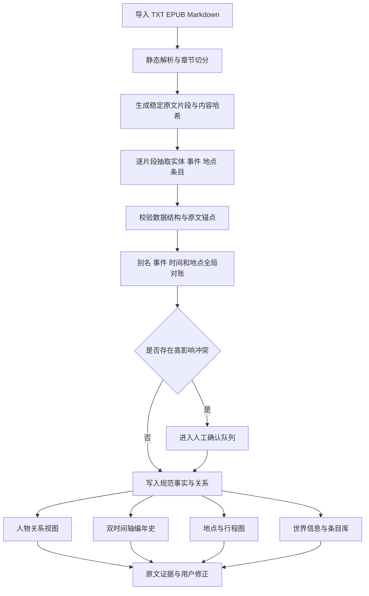

# ExampleOrg 长篇小说知识系统实施计划

核验日期：2026-08-23

审计决定：`reframe`，重构目标后推进可逆的第一阶段

本文全部数值来自供应商官方文档、公开项目页面、项目实测记录或注明的计划估计值

## 1 立项决定

### 1.1 重构后的目标

本产品定位为面向长篇小说读者的可审计故事记忆系统

系统导入 TXT、EPUB 和 Markdown 文本后，逐章建立人物、关系、事件、地点、路径、世界设定和可扩展条目库

每条事实都必须保留原文位置、模型版本、处理版本和置信状态，用户能够回到原文核对并保存修正

默认界面只展示用户当前阅读进度之前的知识，避免准确结果在错误时间出现而造成剧透

### 1.2 需要修正的原始设想

- 输入格式中的 `equb` 按照 EPUB 电子出版物格式实施；第一阶段支持 TXT、EPUB 和 Markdown，PDF 留到后续处理，因为扫描、分栏和页眉会显著增加文本顺序错误
- 编年史使用明确日期、时间区间、相对先后和未知时间 4 种表达；原文缺少日期时保留不确定性，系统不制造精确时间戳
- Kimi Code 订阅只用于个人交互式编程；官方明确排除脚本批处理，产品批量分析改用 Kimi 开放平台[1]
- 测试语料使用公版、开放许可、用户原创或已获明确授权的小说；在线可下载无法单独证明云端处理和再分发获得许可
- 世界地图采用地点节点、层级、路线、交通方式和人物行程构成的逻辑地图；图片底图属于可选显示层
- 世界信息把原文明示、强推断、冲突解释和用户修正分开显示，模型解释不会伪装成原作事实

### 1.3 产品差异

现有产品已经提供多项目标能力

AI Reader V2 提供中文小说的人物图、世界地图、时间线和百科，但项目维护者明确说明当前结果错误较多，项目使用 AGPL-3.0 许可证[2]

StoryCodex 已经提供 EPUB、PDF、TXT、人物档案、世界索引、时间线、关系图、地点行程和防剧透阅读体验[3]

Quilvo 已经实现叙事顺序与故事时间双轴、倒叙定位、人物路线、道路与河流、交通时间检查和地图联动，但它主要服务作者手工建模[4]

Pantser 已经实现自动故事图谱、阅读位置回拨、逐事实原文依据和连续性冲突检查，但它主要服务作者工作流[5]

本产品的差异集中在以下组合：

- 中文超长篇和网文结构优先
- 逐事实证据账本和可重放处理记录
- 叙事顺序、故事时间与读者知情范围同时建模
- 用户修正作为永久覆盖层，模型重跑不能静默覆盖
- DeepSeek 与 Kimi 开放平台之间按任务路由，并对单书成本给出可复算记录
- 地点、交通、事件和人物行程使用同一规范化数据源

界面概念不构成原创性主张，产品价值需要通过准确性、核验效率、剧透控制和成本实验建立

## 2 用户任务

### 2.1 第一阶段用户

第一阶段面向阅读长篇玄幻、仙侠、历史、科幻、悬疑和都市小说的个人读者

作者、编辑、影视改编和文学研究属于后续用户，因为这些角色需要更复杂的协作、版本和版权流程

### 2.2 核心任务

用户需要完成 6 个高频任务：

1. 看到久未出现的人名时，在当前阅读范围内确认身份、别名、最近事件和关系
2. 查看主角当前地点、已经经过的地点、交通方式和下一段可确认路径
3. 在叙事顺序与故事时间之间切换，识别插叙、倒叙、回忆、梦境、预言和时间不明事件
4. 从时间线跳到地图和原文，从地点反查该地发生的历史
5. 查询力量体系、势力、物品、技能、属性、概念和规则，并区分原文明示与模型推断
6. 修正别名误合并、事件时间、人物关系和地点路径，并让修正在增量重跑后继续生效

### 2.3 信息密度

系统保存细粒度候选，默认界面只展示关键事件和高影响关系

用户可以在概览、标准和完整 3 个密度层级之间切换

事件重要性由因果后果、主要人物状态变化、地点迁移、物品归属变化、关系变化和叙事强调共同决定

该评分只控制显示层级，不删除原文证据和低重要性候选

## 3 系统结构

### 3.1 技术选择

第一阶段采用本地优先的浏览器应用，后端使用 Python、FastAPI 和 SQLite，前端垂直切片使用浏览器原生 HTML、CSS 和 JavaScript

原生前端不需要打包工具，可以缩短安全导入和五视图联动的验证周期；真实用户测试证明交互复杂度需要组件化后，再迁移到 React 和 TypeScript

SQLite 同时保存规范化业务数据和 FTS5 全文索引；人物图、地点图和时间线从关系表生成，因此第一阶段不引入 Neo4j

完整 Microsoft GraphRAG 索引具有较高的模型调用成本，官方仓库也要求从小规模开始[6]

本产品只采用图谱思想和分层汇总，不直接运行完整 GraphRAG 流水线

桌面版本在网页垂直切片稳定后使用 Tauri 封装，避免早期同时维护浏览器、后端进程和桌面安装问题

### 3.2 处理流程

下图说明所有模型输出如何经过证据和冲突门禁再进入用户视图

图 3.1 从小说文本到可核验知识视图的处理流程

### 3.3 增量处理

每个原文片段使用书籍版本、章节序号、规范化文本哈希和片段序号形成稳定标识

每次模型调用记录供应商、模型、提示词版本、数据模式版本、输入哈希、token 用量、缓存命中、重试次数和结果状态

章节内容没有变化时复用已有结果

章节内容、提示词或数据模式变化时，只重跑受影响的片段和全局对账分支

用户修正保存在独立覆盖表中，派生视图先应用模型结果，再应用用户覆盖

## 4 规范数据模型

### 4.1 三条时间轴

系统同时保存以下顺序：

- 叙事顺序表示读者在第几章、第几段看到内容
- 故事时间表示事件在虚构世界中何时发生，可以是明确日期、区间、相对顺序或未知
- 知情顺序表示某项真相何时向读者揭示，用于防剧透和不可靠叙述

倒叙事件在叙事顺序和故事时间中各有位置

回忆、梦境、预言、假设、传闻和否定事件还需要保存叙事模式与现实状态，避免把角色说法直接当成已发生事实

### 4.2 核心对象

表 4.1 第一阶段核心对象

| 对象 | 保存内容 | 关键约束 |
|---|---|---|
| `Book` | 书名、版本、来源、权利依据、阅读进度 | 每个导入版本独立保留内容哈希 |
| `SourceSegment` | 章节、段落、字符范围、原文、哈希 | 所有模型事实必须至少关联一个片段 |
| `Entity` | 人物、地点、势力、物品、技能、概念等 | 规范实体与原文提及分离 |
| `Alias` | 别名、称号、代词范围和适用章节 | 自动合并必须可以撤销和拆分 |
| `Claim` | 主体、谓词、对象或值、事实状态 | 保存明示、推断、冲突和用户修正状态 |
| `Event` | 行为、参与者、地点、时间、重要性 | 事件提及与合并后的同一事件分离 |
| `TemporalRelation` | 先于、后于、重叠、包含、同一、未知 | 关系图出现循环时进入冲突队列 |
| `Route` | 起点、终点、方向、交通方式、耗时和距离 | 未被原文支持的距离与耗时保持空值 |
| `JourneyStep` | 人物、事件、地点和顺序 | 主角路线由事件产生，不由地图画线反推 |
| `EntrySchema` | 自定义条目类型和属性约束 | 批量对象可扩展，字段仍需数据模式校验 |
| `Evidence` | 原文锚点、短引文、抽取运行和置信度 | 用户点击后必须定位到正确段落 |
| `Correction` | 修正前后值、理由、时间和作者 | 增量重跑保留修正并显示冲突 |

### 4.3 可扩展数据库

物品、参数、技能和属性不会各自复制一套表结构

系统使用可扩展条目类型与受约束属性定义，例如技能可以声明等级、消耗、使用者和前置条件

所有属性值仍然通过 `Claim` 关联原文证据、适用时间和知情范围

这种设计允许新增丹药、功法、装备、职业、境界、组织职位或科技型号，同时保留统一查询和溯源能力

## 5 长篇准确性方案

### 5.1 输入范围无法替代记忆方案

研究已经发现，模型对长上下文中部的信息利用会显著下降[7]

因此，1M token 上下文只作为全局对账的可选工具，不承担一次读取整本书并直接生成最终数据库的职责

### 5.2 分层抽取

第一层按章节和场景切分，保留少量重叠上下文，抽取实体提及、事件候选、地点、关系陈述和条目候选

第二层按章节合并别名、事件和状态变化，并生成章节事实摘要

第三层按故事卷或情节弧对账人物身份、地点层级、时间关系和世界规则

第四层只把冲突、高影响关系和跨卷别名发送给能力更强的模型复核

每层都输出结构化候选和原文锚点，摘要不能成为下一层唯一证据

### 5.3 确定性校验

系统在模型之外执行以下检查：

- 引用文本必须存在于对应原文片段
- 人物、地点和条目引用的标识必须存在
- 时间关系不能产生无法解释的有向循环
- 人物行程的相邻步骤必须对应已确认地点和事件
- 关系变化需要明确的适用章节或事件边界
- 模型声明为明确日期的值必须能够回指日期表达
- JSON 解析失败、字段缺失、输出截断和空内容进入可重试状态

### 5.4 人工确认

系统按影响排序确认队列，优先展示以下问题：

- 两个高频角色可能被错误合并
- 一个关键事件存在互斥时间解释
- 主角路线出现无证据跳跃
- 力量体系或世界规则出现直接冲突
- 低置信事实会影响大量派生关系

用户确认会形成永久覆盖记录

## 6 模型经济性

### 6.1 供应商边界

DeepSeek API 和 Kimi 开放平台都提供 OpenAI 兼容接口，应用使用统一供应商适配层

Kimi Code 会员接口不进入批量生产链路[1]

密钥只保存在后端进程或操作系统安全存储中，浏览器和数据库不会获得明文密钥

### 6.2 建议路由

表 6.1 建议模型路由

| 任务 | 默认模型 | 升级条件 |
|---|---|---|
| 逐片段实体与事件抽取 | DeepSeek V4 Flash 非思考模式 | 数据模式连续失败或关键字段冲突 |
| 章节事实合并 | DeepSeek V4 Flash | 高频别名或时间关系存在冲突 |
| 跨卷别名与复杂时间复核 | DeepSeek V4 Pro 或 Kimi K3 | 只处理冲突证据包，不发送无关全文 |
| 大规模离线抽取 | Kimi K2.6 Batch | 用户选择 Kimi 开放平台且允许等待 |
| 交互问答 | 先检索证据，再调用用户选择的模型 | 回答必须返回原文来源 |

### 6.3 价格基线

截至 2026-08-23，DeepSeek 官方人民币价格按北京时间高峰与空闲时段区分

DeepSeek V4 Flash 的百万 token 空闲时段价格为缓存命中输入 0.05 元、缓存未命中输入 1.5 元、输出 4.5 元；高峰时段对应 0.10 元、3.0 元和 9.0 元[8]

Kimi 开放平台官网显示 Kimi K2.6 的百万 token 价格为缓存命中输入 1.10 元、普通输入 6.50 元、输出 27.00 元，Kimi K3 对应 2.00 元、20.00 元和 100.00 元[9]

Kimi Batch API 官方说明相对实时调用节省 40%，当前支持 Kimi K2.6 和 Kimi K2.5[10]

供应商可以调整价格，系统在每次任务开始前读取配置中的现行单价，并用下式给出预算上限：

$$
C = T_h P_h + T_m P_m + T_o P_o
$$

$T_h$、$T_m$ 和 $T_o$ 分别表示缓存命中输入、缓存未命中输入和输出 token；$P_h$、$P_m$ 和 $P_o$ 表示对应的百万 token 单价

系统使用实际 API 用量字段结算，字符数换算只用于任务前预估

### 6.4 降本措施

- 固定系统提示词和数据模式前缀，提高上下文缓存命中机会
- 章节抽取使用短输出和枚举字段，减少重复说明
- 默认模型只产生候选，强模型只复核冲突证据包
- 内容哈希相同的片段不重复调用
- 低实时任务支持批量 API
- 任务开始前显示预计 token、预计费用和用户设定的硬上限
- 保存每本书、每阶段和每模型的实际 token、费用、重试和失败记录

## 7 风险边界

### 7.1 EPUB 静态解析

EPUB 3.3 是 ZIP 容器中的结构化出版物，可以包含 XHTML、SVG、脚本和远程资源[11]

导入器只读取容器、包文档、导航和静态正文

导入器不执行脚本、不加载远程资源、不绕过数字版权管理，并限制压缩前后大小、文件数量、嵌套深度和路径范围

### 7.2 文本权利

首批完整长篇样本使用 Project Gutenberg 的公版《西游记》和维基文库标明为全球公有领域的《三国演义》[12][13]

现代玄幻和都市小说需要用户提供拥有处理权的文本，或者使用专门编写的合成长篇基准

系统记录每本样本的来源、版本、权利依据、适用地域和核验日期

导出物默认只包含短引文和位置锚点，不连续导出可替代原作的正文

### 7.3 云端处理

云端只发送当前片段和必要对账证据

未公开手稿、自传、私人笔记和包含现实人物敏感信息的文本默认留在本地

正式发布前需要核实 DeepSeek 与 Kimi 的接口专属训练、服务优化、数据保留、删除、分包商和跨境条款

### 7.4 提示注入

小说正文始终作为不可信数据传入模型

抽取模型不获得网络、文件系统、命令或消息发送工具

正文中要求忽略规则、泄露密钥或调用工具的句子只会作为小说内容处理

模型输出经过固定数据模式和原文锚点校验后才能进入规范数据库

## 8 验收体系

### 8.1 基准语料

第一组使用《西游记》检查多重别名、跨世界地点、法术物品和主角长距离行程

第二组使用《三国演义》检查大规模人物、势力、明确年代、战争地点和多线事件

第三组使用合成小说检查现代都市、平行叙事、倒叙、梦境、时间循环、同名人物和不可靠叙述

每组建立双人独立核对的金标准，分歧保留为不确定答案

### 8.2 分项指标

系统不使用一个总准确率掩盖错误类型

表 8.1 验收指标和第一阶段建议门槛

| 指标 | 计算方式 | 第一阶段建议门槛 |
|---|---|---|
| 原文锚点正确率 | 打开正确段落的证据数 ÷ 抽查证据数 | 100% |
| 关键人物精确率 | 正确规范人物数 ÷ 系统输出规范人物数 | 不低于 95% |
| 关键人物召回率 | 找到的金标准人物数 ÷ 金标准人物数 | 不低于 90% |
| 关键关系精确率 | 正确关系数 ÷ 系统输出关系数 | 不低于 90% |
| 关键事件覆盖率 | 找到的关键事件数 ÷ 金标准关键事件数 | 不低于 90% |
| 时间关系准确率 | 正确先后或重叠关系数 ÷ 已判定关系数 | 不低于 85% |
| 剧透事件数 | 当前阅读范围外仍被显示的事实数 | 0 |
| 修正保留率 | 重跑后继续生效的用户修正数 ÷ 修正总数 | 100% |
| 成本可复算率 | 能由 token 与单价重算的调用费用 ÷ 调用总费用 | 100% |

注：表中门槛属于本项目第一阶段建议值，需要在首轮人工标注后根据任务难度校准

### 8.3 用户验证

计划招募至少 8 名真实目标读者，数量属于第一阶段研究计划值

参与者分别使用普通全文搜索和本系统完成认人、找地点、追踪路线、排序倒叙、核对设定和修正错误任务

测试记录任务完成率、完成时间、误判、剧透、核验次数、纠错时间、单书成本和主观信任

代理模拟和模型互评只用于发现问题，不能证明真实读者满意

## 9 分阶段实施

以下周期是按 1 名全职开发者估算的计划值，外部模型稳定性和真实用户招募会改变周期

### 9.1 阶段 A：可运行垂直切片，计划 1 周

- 建立 TXT、EPUB 和 Markdown 安全导入
- 建立 SQLite 数据库、全文索引和稳定原文锚点
- 建立 DeepSeek、Kimi 开放平台和模拟供应商适配层
- 建立人物、关系、事件、地点、路线、条目和证据的最小数据模式
- 提供人物、时间线、地点图、世界信息和条目库的联动界面
- 使用公版片段完成端到端演示

### 9.2 阶段 B：证据化抽取，计划 2 周

- 完成逐片段抽取、结构校验、失败重试和断点恢复
- 完成原文证据跳转、模型运行账本和费用记录
- 完成别名候选与人工合并、拆分
- 完成用户修正覆盖层

### 9.3 阶段 C：时空联动，计划 2 周

- 完成叙事顺序、故事时间、知情顺序和不确定时间
- 完成回忆、倒叙、梦境、预言、传闻和否定事件状态
- 完成地点层级、交通方式、主角行程和时间线双向联动
- 完成时间循环与路径跳跃冲突检查

### 9.4 阶段 D：世界条目，计划 1 周

- 完成力量体系、势力、规则和背景的证据化汇总
- 完成物品、技能、属性和自定义条目类型
- 完成概览、标准和完整密度层级
- 完成搜索、筛选、矩阵和文本替代视图

### 9.5 阶段 E：基准优化，计划 2 周

- 完成 3 组基准语料和分项评分
- 对比 DeepSeek V4 Flash、DeepSeek V4 Pro 与 Kimi 开放平台模型
- 校准分片、缓存、批量处理和冲突升级策略
- 建立质量回归和费用回归门禁

### 9.6 阶段 F：桌面测试版，计划 1 至 2 周

- 使用 Tauri 封装 Windows 和 macOS 桌面版本
- 使用操作系统安全存储保存密钥
- 完成备份、导出、删除和恢复演练
- 完成键盘、屏幕阅读器、焦点和减少动态效果验证

按上述计划相加，第一轮桌面测试版预计需要 9 至 10 周

计算过程为 $1+2+2+1+2+(1\text{ 至 }2)=9\text{ 至 }10$ 周

## 10 第一阶段完成边界

第一阶段达到以下条件后才能扩大功能：

- TXT、EPUB 和 Markdown 可以安全导入，并保持章节阅读顺序
- 每条人物、关系、事件、地点和条目事实可以跳到正确原文
- 叙事顺序与故事时间能够分开查看，未知时间保持未知
- 人物关系、时间线、地点路径和条目库能够双向跳转
- 用户修正经过重跑后继续生效
- 当前阅读进度之外的事实不会出现在任何默认视图、搜索或问答中
- 每次模型调用的 token、费用、缓存和失败状态可以复算
- 公版基准达到表 8.1 的门槛，或者系统明确收缩到能够达标的功能范围

## 11 复审机制

当前可逆默认值如下：

- 产品用户：个人读者优先
- 部署方式：本地优先，云端只承担用户明确选择的模型调用
- 代码来源：干净实现，不复制 AI Reader V2 的 AGPL 代码
- 模型策略：DeepSeek V4 Flash 默认抽取，强模型只复核冲突
- 测试文本：《西游记》《三国演义》和合成现代题材文本
- 产品语言：简体中文优先，数据模式保留多语言能力

以下观察会触发重新审计：

- 关键人物、关系或时间指标连续 2 轮没有改善
- 单书实际费用超过用户设定预算
- 出现剧透、错误原文锚点或用户修正丢失
- 新的直接替代产品覆盖证据化自动抽取和低成本中文长篇
- DeepSeek 或 Kimi 的模型、价格、数据条款或接口发生破坏性变化
- 用户更需要搜索、人物卡和证据跳转，复杂图谱的使用率持续偏低

如果复杂图谱无法达到质量门槛，产品先收缩到全文搜索、人物卡、证据跳转和半自动确认队列

## 12 参考文献

[1] Moonshot AI, [Kimi Code 社区倡议](https://www.kimi.com/code/docs/kimi-code/community-guidelines.html), 访问于 2026-08-23

[2] mouseart2025, [AI Reader V2](https://github.com/mouseart2025/AI-Reader-V2), GitHub, 访问于 2026-08-23

[3] ForgeApps, [StoryCodex](https://storycodex.app/), 访问于 2026-08-23

[4] Quilvo, [Story Maps](https://quilvo.app/features/story-maps), 访问于 2026-08-23

[5] Pantser, [The Story Atlas](https://pantser.io/features/story-atlas), 访问于 2026-08-23

[6] Microsoft, [GraphRAG](https://github.com/microsoft/graphrag), GitHub, 访问于 2026-08-23

[7] N. F. Liu et al., [“Lost in the Middle: How Language Models Use Long Contexts”](https://arxiv.org/abs/2307.03172), 2023

[8] DeepSeek, [模型与价格](https://api-docs.deepseek.com/zh-cn/quick_start/pricing/), 访问于 2026-08-23

[9] Moonshot AI, [Kimi 开放平台](https://platform.kimi.com/), 访问于 2026-08-23

[10] Moonshot AI, [使用 Batch API 批量处理任务](https://platform.kimi.com/docs/guide/use-batch-api), 访问于 2026-08-23

[11] W3C, [EPUB 3.3](https://www.w3.org/TR/epub-33/), Recommendation, 2026-01-13

[12] Project Gutenberg, [《西游记》电子书第 23962 号](https://www.gutenberg.org/ebooks/23962), 访问于 2026-08-23

[13] Wikimedia Foundation, [《三国演义》](https://zh.wikisource.org/zh-hans/%E4%B8%89%E5%9B%BD%E6%BC%94%E4%B9%89), 维基文库, 访问于 2026-08-23
