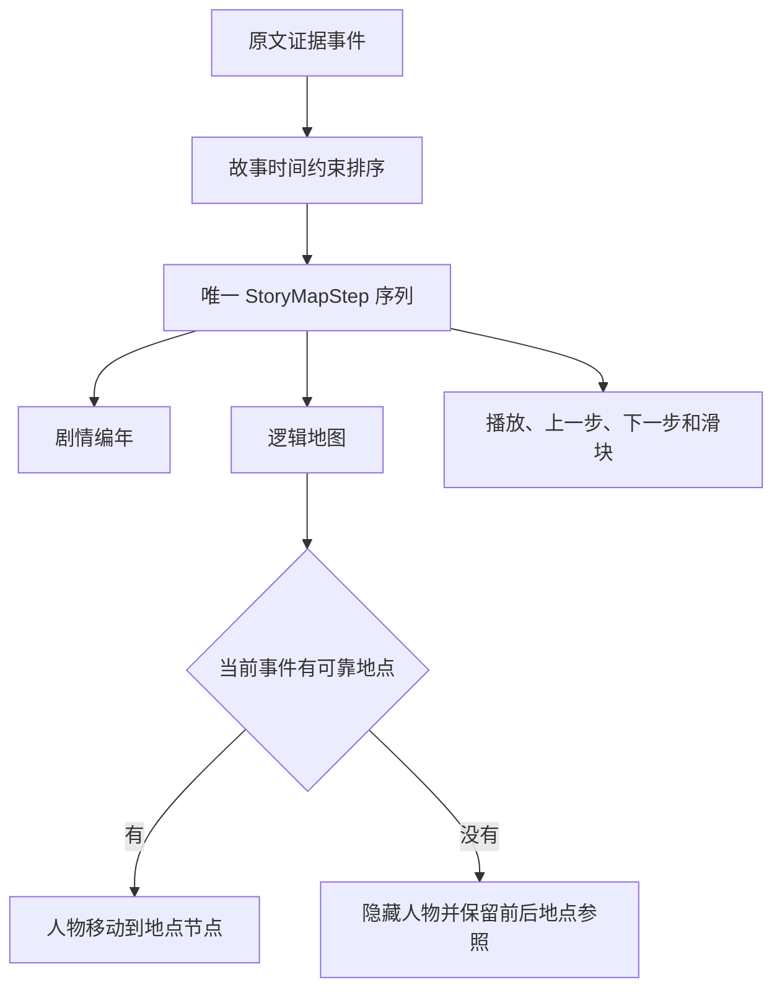

# 小说证据图谱 2.5.0 验证报告

验收日期：2026-08-25

验收对象：全量人物关系、故事编年与逻辑地图统一、百级地点布局、快速点击竞态、未知地点处理、自动用量适配和 Windows 成品

## 1 验收结论

2.5.0 已经接管本机 `http://127.0.0.1:8765/`。现有数据库升级后保留 11 本书，页面、应用程序接口和浏览器控制台正常。

本轮解决的是结构完整性、界面联动和运行稳定性。正式内容准确率门禁继续保持关闭；真实小说仍需达到 300 条已确认金标准、至少 20% 保留测试、关键案例 100% 通过和保留集加权准确率不低于 95%，才能宣布质量达标。

## 2 本轮实现结果

表 1 功能重构与实测结果

| 项目 | 实测结果 | 结论 |
|---|---:|---|
| 人物关系 | 删除“核心关系”和“全部关系”两套数据，页面只展示全量有证据关系 | 通过 |
| 地图与编年 | 后端返回唯一 `StoryMapStep` 顺序，编年、地图、滑块和播放共用同一事件编号 | 通过 |
| 120 章压力演示 | 120 条编年、120 个地图步骤，首尾及全部事件编号逐项相同 | 通过 |
| 《西游记》长篇数据 | 203 个原文章节、552 个实体、627 条关系、1,049 条编年和 1,049 个地图步骤 | 通过 |
| 地点未知事件 | 《西游记》中 650 条事件保留在编年；人物标记隐藏，前后已知地点作为参照 | 通过 |
| 地图布局 | 中小地图使用 fCoSE；百级地点图使用 CoSE，再投影原文明示方位 | 通过 |
| 路线去重 | 重复起终点合成一条底层拓扑边，出现次数和交通方式保留在说明中 | 通过 |
| 快速点击 | 120 章演示连续点击 20 次停在第 21 步；《西游记》连续点击 40 次停在第 43 步 | 通过 |
| 动画坐标 | 快速点击结束后，人物标记坐标与当前地点节点坐标完全相同 | 通过 |
| 末步状态 | 第 120 步显示“已到末步”，按钮禁用，无永久转圈 | 通过 |
| 自动用量适配 | 默认按整书预估和累计真实用量自动扩容，保留全局紧急保护线和人工上限模式 | 通过 |
| 自动测试 | 91 项全部通过 | 通过 |
| 浏览器控制台 | 真实《西游记》和正式 2.5.0 页面均为 0 错误、0 警告 | 通过 |

注：全量关系指已经通过证据和身份门禁的正式关系。仍在自动复审或证据不足的候选继续隔离，避免把未确认关系伪装成事实。

## 3 唯一故事步骤

逻辑地图不再从“主角参与且有地点”的事件中另建行程。后端先计算故事编年，再为每个事件补充地点状态和路线状态，形成唯一 `StoryMapStep` 序列。

图 1 地图与编年的单一数据路径

兼容字段 `journey_events` 暂时保留，但它与 `story_map_steps` 指向相同的有序数据，不会形成第二套顺序。

## 4 自动用量适配

默认任务使用自动模式。创建任务时根据整书预估增加 20% 余量；每次模型调用前和实际用量落盘后再次检查。预估增加时，任务在紧急保护线内自动扩容，并记录调整次数。

表 2 用量控制边界

| 边界 | 2.5.0 默认行为 |
|---|---|
| 普通长篇超过初始参考值 | 自动扩大金额和令牌范围，任务继续 |
| 用户切换到人工上限 | 达到用户上限后暂停 |
| 输入超过 500,000,000 令牌 | 触发全局紧急保护线 |
| 输出超过 100,000,000 令牌 | 触发全局紧急保护线 |
| 可复算费用超过 1,000 美元 | 触发全局紧急保护线 |

全局紧急保护线防止异常解析、循环任务或错误价格配置无限消耗。它远高于正常单本小说需要，并且可以通过后续正式配置迁移调整。

## 5 真实浏览器验收

第一步，在 120 章压力演示中打开逻辑地图，确认页面显示 1/120，连续快速点击 20 次。

第二步，确认页面停在 21/120、“第21日抵达空桑城”，人物标记坐标与空桑城节点坐标相同。

第三步，滑到 120/120，确认按钮显示“已到末步”并禁用，页面没有转圈。

第四步，切换到真实《西游记》，确认关系页显示全量 199 个正式节点和 510 条正式关系。

第五步，打开 1,049 步逻辑地图。第 3 步“美猴王忧恼”地点待确认，人物标记隐藏，地图保留 8 个上下文参照节点。

第六步，从第 3 步连续快速点击 40 次。页面准确停在 43/1049、“悟空偷吃金丹”，人物标记坐标与兜率宫节点坐标相同。

第七步，检查浏览器控制台和网络页面。正式成品返回 HTTP 200，版本显示 2.5.0，控制台为 0 错误、0 警告。

## 6 成品与恢复

- Windows 成品：[NovelAtlasWindows.exe](../dist-v2.5.0/NovelAtlasWindows/NovelAtlasWindows.exe)
- Windows 压缩包：[NovelAtlasWindows-2.5.0.zip](../dist-v2.5.0/NovelAtlasWindows-2.5.0.zip)
- 正式数据库升级前备份：`%LOCALAPPDATA%\NovelAtlas\backups\novel_atlas-before-v2.5.0-20260825.db`
- 当前正式地址：`http://127.0.0.1:8765/`

## 7 当前质量边界

2.5.0 可以证明以下结果：

- 编年和地图事件数量、编号及顺序一致。
- 正式结果具有可定位的原文证据。
- 地点未知不会导致事件丢失或伪造地点。
- 地图动画、快速切换和末步控制没有已知竞态。
- 自动用量适配不会被较小的初始参考值无故打断。

2.5.0 仍然不能证明任意小说内容准确率达到 95%。下一阶段需要继续确认真实小说金标准，再用固定保留集比较 DeepSeek、Moonshot 和 Codex Luna。关键主体、身份、关系、主线顺序或主要行程出现错误时，对应模型不能获得正式自动流量。
